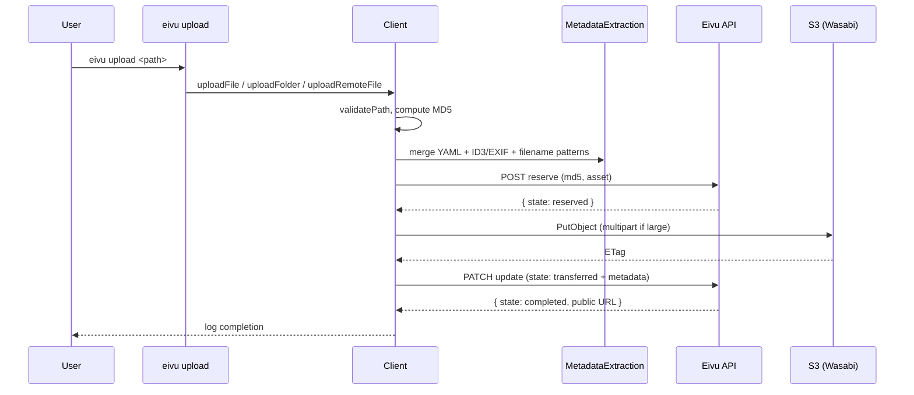
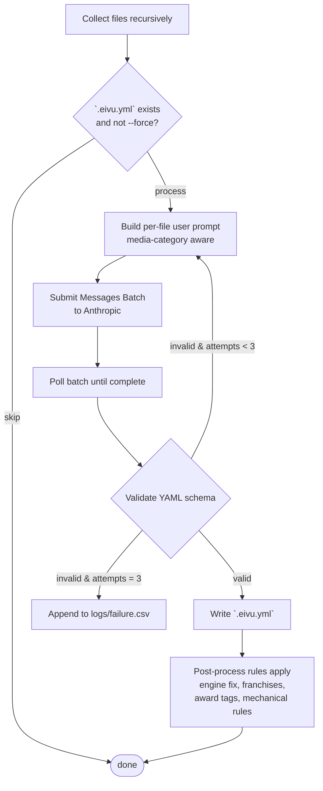

# eivu-upload-client

A TypeScript CLI for uploading media files to an [Eivu](https://github.com/eivu) backend, compressing comic archives, and generating rich metadata files using Claude AI. Built on [oclif](https://oclif.io).

[](https://oclif.io)
[](https://npmjs.org/package/eivu-upload-client)
[](https://npmjs.org/package/eivu-upload-client)
[](https://opensource.org/licenses/MIT)

## Contents

- [Overview](#overview)
- [Quickstart](#quickstart)
- [Configuration](#configuration)
- [Commands](#commands)
  - [`eivu upload`](#eivu-upload-path)
  - [`eivu compress`](#eivu-compress-path)
  - [`eivu generate-metadata:ai`](#eivu-generate-metadataai-path)
  - [`eivu generate-metadata:post-process`](#eivu-generate-metadatapost-process-file)
- [`.eivu.yml` Metadata Files](#eivuyml-metadata-files)
- [Architecture](#architecture)
- [Development](#development)
- [License](#license)

## Overview

`eivu-upload-client` is the TypeScript client for the Eivu media library. It does three things:

1. **Upload** local files, folders, or remote URLs into Eivu — files land in S3-compatible storage (Wasabi by default) while the Eivu backend tracks state and metadata.
2. **Compress** comic book archives (`.cbz`, `.cbr`) into smaller `.cbz` archives whose pages are WebP, via [`@eivu/ts-comic-compress`](https://www.npmjs.com/package/@eivu/ts-comic-compress).
3. **Generate metadata** as `.eivu.yml` files using Claude AI — with web search for verification, schema validation, and a post-processing pipeline that normalises engine versions, franchise hierarchies, award tags, and other mechanical rules.

The tool is intended for users curating their own Eivu library: the upload pipeline reserves a slot in the Eivu backend, transfers the file to S3, and updates the backend with merged metadata from `.eivu.yml` files, embedded tags (ID3, EXIF), and filename patterns.

```mermaid
flowchart LR
    User([User]) -->|eivu CLI| CLI{Command}
    CLI -->|upload| Upload[Client.upload*]
    CLI -->|compress| Compress[ComicProcessor]
    CLI -->|gm:ai| AIGen[MetadataGenerator]
    CLI -->|gm:pp| PP[PostProcessRules]

    Upload --> Extract[MetadataExtraction]
    Upload --> S3[S3Uploader]
    Upload --> API[(Eivu API)]
    S3 --> Storage[(S3-compatible storage<br/>e.g. Wasabi)]

    Compress -->|@eivu/ts-comic-compress| WebP[(.cbz with WebP pages)]

    AIGen --> Claude[ClaudeAgent]
    Claude --> Anthropic[(Anthropic Messages<br/>Batches API + Web Search)]
    AIGen --> YAML[(.eivu.yml files)]

    PP --> YAML
```

## Quickstart

```sh
npm install -g eivu-upload-client
```

Set the required environment variables (see [Configuration](#configuration)) — `dotenv` loads them automatically from a `.env` in the working directory:

```sh
# .env
EIVU_UPLOAD_SERVER_HOST=https://eivu.example.com
EIVU_BUCKET_UUID=00000000-0000-0000-0000-000000000000
EIVU_USER_TOKEN=your_api_token
EIVU_BUCKET_NAME=my-bucket
EIVU_REGION=us-east-1
EIVU_ENDPOINT=https://s3.wasabisys.com
EIVU_ACCESS_KEY_ID=...
EIVU_SECRET_ACCESS_KEY=...
ANTHROPIC_API_KEY=sk-ant-...   # only required for `gm:ai`
```

Then:

```sh
eivu upload ./my-video.mp4
eivu compress ./comics --recursive
eivu gm:ai ./comics --recursive
eivu --help
```

## Configuration

All configuration is via environment variables. Missing required variables cause the CLI to fail fast on first use.

| Variable | Required | Purpose |
|---|---|---|
| `EIVU_UPLOAD_SERVER_HOST` | yes | Base URL of the Eivu upload server. Used as `${HOST}/api/upload/v1/buckets/${BUCKET_UUID}/`. |
| `EIVU_BUCKET_UUID` | yes | Eivu bucket identifier. |
| `EIVU_USER_TOKEN` | yes | API token sent as `Authorization: Token ${TOKEN}`. |
| `EIVU_BUCKET_NAME` | yes | S3 bucket name where assets are stored. |
| `EIVU_REGION` | yes | S3 region (e.g. `us-east-1`). |
| `EIVU_ENDPOINT` | yes | S3 endpoint URL (e.g. `https://s3.wasabisys.com`). |
| `EIVU_ACCESS_KEY_ID` | yes | S3 access key. |
| `EIVU_SECRET_ACCESS_KEY` | yes | S3 secret key. |
| `ANTHROPIC_API_KEY` | only for `gm:ai` | Anthropic API key used by `generate-metadata:ai`. |

Validation logic lives in [src/env.ts](src/env.ts).

## Commands

### `eivu upload <path>`

Upload a local file, a local directory, or a remote URL.

```
eivu upload <path> [-f <filename>] [-n] [-s]
```

| Flag | Description |
|---|---|
| `-f, --filename <value>` | Filename to use when uploading from a remote URL. |
| `-n, --nsfw` | Mark the uploaded file as NSFW. |
| `-s, --secured` | Mark the file as secured (also implies `--nsfw`). |

Behavior:

- If `<path>` is a **file**, it's uploaded directly.
- If `<path>` is a **directory**, files within are uploaded with bounded concurrency. Auxiliary files (e.g. `.eivu.yml`, `.cue`, `.log`, `.DS_Store`) and folders like `.git` and `podcasts` are skipped — see `Client.SKIPPABLE_EXTENSIONS` / `SKIPPABLE_FOLDERS` in [src/client.ts](src/client.ts).
- If `<path>` is a **URL** that resolves online, the resource is downloaded and uploaded.

For each file the client:

1. Validates the path and computes an MD5.
2. Merges metadata from any neighbouring `.eivu.yml`, embedded tags (ID3, EXIF), and filename patterns.
3. Reserves a slot in the Eivu backend (`POST` reserve).
4. Uploads the bytes to S3 via the AWS SDK v3 multipart uploader.
5. Updates the backend with metadata and marks the file `transferred` → `completed`.



### `eivu compress <path>`

Compress comic archives into smaller `.cbz` files whose pages are WebP.

```
eivu compress <path> [-o <dir>] [-q <0-100>] [-r] [-m] [-n] [-s] [-p]
                     [-t <px>] [--no-raiseException]
```

| Flag | Default | Description |
|---|---|---|
| `-o, --outputDir <value>` | `<input-dir>/converted/` | Output directory for compressed files. |
| `-q, --quality <0-100>` | `75` | WebP quality. |
| `-r, --recursive` | `false` | Traverse subdirectories. |
| `-m, --moveOriginal` | `false` | Move originals into a `done/` subdirectory after success. |
| `-n, --renameOriginal` | `false` | Rename originals to `*_original` instead of copying. |
| `-s, --skipExisting` | `false` | Skip files that already exist in the output directory. |
| `-p, --parallel` | `false` | Use all available compute resources. |
| `-t, --targetHeight <px>` | unset | Resize to this height while preserving aspect ratio. |
| `-e, --[no-]raiseException` | `true` | Raise an exception when an image is skipped due to size constraints. |

A non-archive file (anything other than `.cbz` / `.cbr`) raises `IncorrectFileTypeError`. Compression is delegated to [`@eivu/ts-comic-compress`](https://www.npmjs.com/package/@eivu/ts-comic-compress).

### `eivu generate-metadata:ai <path>`

Aliases: `gm:ai`

Generate `.eivu.yml` metadata files for one file or a folder of media using Claude. Requires `ANTHROPIC_API_KEY`.

```
eivu gm:ai <path> [-f] [-r] [-n <name>]
```

| Flag | Description |
|---|---|
| `-f, --force` | Overwrite existing `.eivu.yml` files. By default, files that already have a sibling `.eivu.yml` are skipped. |
| `-r, --recursive` | When `<path>` is a folder, include files in all subdirectories. |
| `-n, --name <value>` | Base name for the output `.eivu.yml` file. Single-file mode only — ignored if multiple files are processed. |

Behavior:

- Recursively collects files in `<path>`, skipping `.git`, `.idea`, `.vscode`, `.env*`, `.DS_Store`, etc.
- Submits prompts in batches via the [Anthropic Messages Batches API](https://docs.claude.com/en/api/messages-batches), with the web search tool enabled so Claude can verify titles, authors, characters, and franchises against the open web.
- Validates each generated YAML against the schema and **retries up to 3 times** when validation fails. Files that still fail after retries are appended to `logs/failure.csv`.
- Successful results are written next to the original file as `<filename>.eivu.yml`, and run through a post-processing rule pipeline (engine fix, parent-franchise injection, award-tag normalisation, mechanical rules).



For the full `.eivu.yml` specification used by AI generation, see [EIVU_METADATA_AI_GUIDE.md](EIVU_METADATA_AI_GUIDE.md).

### `eivu generate-metadata:post-process <file>`

Aliases: `gm:post-process`, `gm:pp`

Run an existing `.eivu.yml` file through the post-processing pipeline and print the result to stdout. Useful for re-normalising older metadata after the rules evolve.

```
eivu gm:pp <file> [-m <model>]
```

| Flag | Description |
|---|---|
| `-m, --model <value>` | Override the `ai:engine` value. Defaults to whatever is already in the YAML, or `unknown`. |

The pipeline applies (in order): `ai:engine` correction, parent-franchise hierarchy injection, award-tag normalisation, and six mechanical rules (numeric unquoting, genre casing, redundant tag removal, etc.).

## `.eivu.yml` Metadata Files

Eivu uses YAML metadata files (with the `.eivu.yml` extension) to attach rich metadata to uploaded files — beyond what can be extracted from filenames or embedded tags.

### File Naming Conventions

There are two types of `.eivu.yml` files:

#### 1. Associated Metadata Files

Named after the file they describe by appending `.eivu.yml`:

```
myfile.txt.eivu.yml          # Metadata for myfile.txt
comic.cbz.eivu.yml           # Metadata for comic.cbz
song.mp3.eivu.yml            # Metadata for song.mp3
```

When you upload a file, the client looks for the matching `.eivu.yml` next to it and merges that metadata with anything extracted automatically.

#### 2. Standalone Metadata Files (for bulk updates)

For bulk updating already-uploaded files, the metadata file is named with the uppercase MD5 hash of the cloud file:

```
6068BE59B486F912BB432DDA00D8949B.eivu.yml
```

The MD5 identifies which cloud file to update on the server.

### Metadata File Structure

Top-level fields:

- `name` (string) — title or display name
- `description` (string) — long description (supports multi-line)
- `year` (number) — year associated with the content
- `duration` (number) — duration in seconds (audio/video)
- `info_url` (string) — URL with more information
- `artwork_md5` (string) — MD5 of associated artwork file
- `rating` (number) — **deprecated**; use `ai:rating` inside `metadata_list` instead

#### Metadata List

`metadata_list` is an array of single-key objects with additional metadata:

```yaml
metadata_list:
  - tag: horror
  - tag: thriller
  - performer: John Doe
  - studio: XYZ Productions
  - character: Batman
  - genre: Superhero
```

Common keys: `tag`, `performer`, `studio`, `character`, `genre`, `writer`, `artist`, `publisher`, `source_url`, `synopsis`.

Namespaced keys carry typed metadata:

- `eivu:*` — Eivu-specific (e.g. `eivu:artist_name`, `eivu:release_name`)
- `id3:*` — ID3 tag metadata (e.g. `id3:album`, `id3:artist`)
- `acoustid:*` — Acoustid fingerprint data
- `override:*` — explicit overrides (e.g. `override:name`)
- `ai:*` — AI-generation provenance (e.g. `ai:engine`, `ai:rating`, `ai:rating_reasoning`, `ai:skill_version`)

### Example

A comic book entry:

```yaml
name: The Peacemaker #1
year: 1967
description: |
  The fleets of various foreign countries have been fishing near maritime
  borders of other countries and have recently become the target of sabotage.
  U.S. Diplomat Christopher Smith investigates as the Peacemaker.
info_url: https://dc.fandom.com/wiki/Peacemaker_Vol_1_1
metadata_list:
  - character: Christopher Smith
  - character: Peacemaker
  - cover_artist: Pat Boyette
  - penciler: Pat Boyette
  - inker: Pat Boyette
  - letterer: Pat Boyette
  - writer: Joe Gill
  - publisher: Charlton Comics
  - publisher: DC Comics
  - tag: Peacemaker
  - source_url: https://comicbookplus.com/?dlid=70555
  - synopsis: The Commodore has been damaging fishing fleets, but the Peacemaker captures him and destroys his submarine
```

### Metadata Extraction Priority

When processing a file, metadata is merged in priority order (highest first):

1. Explicit metadata from `.eivu.yml` files
2. Embedded file metadata (ID3 tags for audio, EXIF for images, etc.)
3. Metadata extracted from filenames using tag patterns (`((tag))`, `((p performer))`, `((s studio))`, `((y 2024))`, rating glyphs)
4. Default values

Higher-priority sources override lower-priority sources on conflict.

### AI Assistant Guide

For the complete specification used when generating `.eivu.yml` files programmatically (collection vs. single-issue disambiguation, character canonicalisation, franchise hierarchy, award handling, etc.), see [EIVU_METADATA_AI_GUIDE.md](EIVU_METADATA_AI_GUIDE.md).

## Architecture

At a glance:

- **Commands** — [src/commands/](src/commands/) — one oclif `Command` per file; auto-discovered from `dist/commands/` after build.
- **Client** — [src/client.ts](src/client.ts) — orchestrates uploads (`uploadFile`, `uploadFolder`, `uploadRemoteFile`, `bulkUpdateCloudFiles`).
- **CloudFile** — [src/cloud-file.ts](src/cloud-file.ts) — entity wrapping the upload state machine (`reserved` → `transferred` → `completed`).
- **S3 uploader** — [src/s3-uploader.ts](src/s3-uploader.ts) — multipart upload via `@aws-sdk/lib-storage`.
- **Metadata extraction** — [src/metadata-extraction.ts](src/metadata-extraction.ts) — multi-source merge (YAML, ID3, EXIF, filename patterns).
- **AI agents** — [src/ai/](src/ai/) — `BaseAgent` strategy with a working `ClaudeAgent`; `MetadataGenerator` orchestrates batching, validation retry, and post-processing.
- **Services** — [src/services/api.config.ts](src/services/api.config.ts) — pre-authenticated axios instances for the Eivu REST API.
- **Env validation** — [src/env.ts](src/env.ts) — fail-fast validation of required environment variables.

Deeper dives:

- [docs/client.md](docs/client.md) — `Client` class internals
- [docs/cloud-file.md](docs/cloud-file.md) — `CloudFile` entity
- [docs/metadata-generator.md](docs/metadata-generator.md) — AI metadata pipeline
- [EIVU_METADATA_AI_GUIDE.md](EIVU_METADATA_AI_GUIDE.md) — full `.eivu.yml` spec for AI generation

## Development

Requires Node `>=18.0.0`.

```sh
git clone https://github.com/eivu/client-typescript.git
cd client-typescript
npm install
npm run build           # tsc -b && tsc-alias
npm test                # jest (with coverage); posttest runs lint
npm run lint            # eslint
npm run lint:fix        # eslint --fix
./bin/run.js --help     # exercise the CLI from source
```

The `music-metadata` audio-fingerprint path uses [Chromaprint](https://acoustid.org/chromaprint)'s `fpcalc` binary. CI installs it via `apt-get install -y libchromaprint-tools`; on macOS use `brew install chromaprint`. CI runs the matrix `lts/-1`, `lts/*`, and `latest` on Ubuntu — see [.github/workflows/test.yml](.github/workflows/test.yml).

If you're working in this repo with Claude Code, see [CLAUDE.md](CLAUDE.md) for an in-repo agent guide (architecture map, conventions, gotchas).

## License

MIT · Issues: <https://github.com/eivu/client-typescript/issues>
